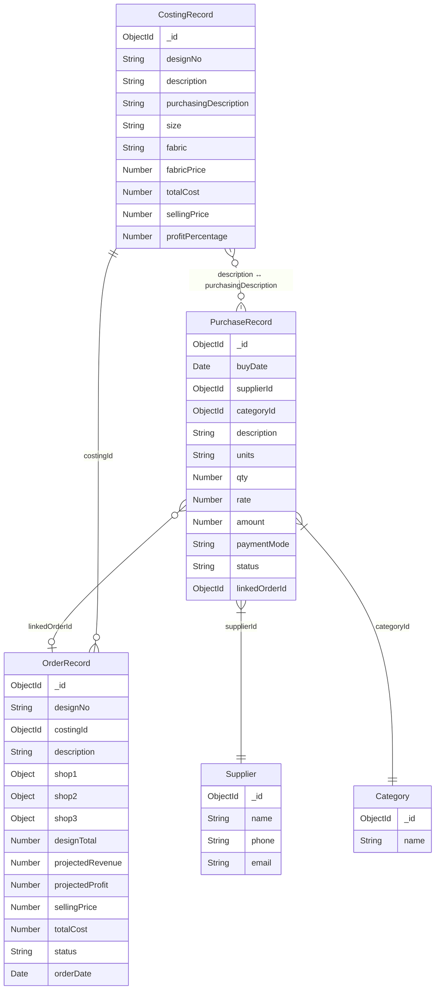

# 09 — Relations Guide (Cross-Module)

> **How the Orders module connects to Costing and Purchasing**

---

## Architecture Overview

```
┌─────────────────────────────────────────────────────────────────────────┐
│                          LOOK@ME System                                 │
├──────────────────┬──────────────────┬───────────────────────────────────┤
│                  │                  │                                   │
│   PURCHASING     │     COSTING      │         ORDERS                    │
│                  │                  │                                   │
│  ┌────────────┐  │  ┌────────────┐  │  ┌────────────────────┐          │
│  │ Purchase   │  │  │ Costing    │  │  │ Order              │          │
│  │ Record     │──┼──│ Record     │──┼──│ Record             │          │
│  │            │  │  │            │  │  │                    │          │
│  │ description│→ │  │ purch.Desc │  │  │ costingId  ──────→ CostingId │
│  │ category   │  │  │ designNo ★ │  │  │ designNo          │          │
│  │ supplier   │  │  │ sellingPrc │  │  │ description       │          │
│  │ amount     │  │  │ totalCost  │  │  │ shop1/2/3 qty+sz  │          │
│  │ status     │  │  │ profit %   │  │  │ designTotal       │          │
│  │ linkedOrder│←─┼──┼────────────┼──┼──│ projectedRevenue  │          │
│  └────────────┘  │  └────────────┘  │  └────────────────────┘          │
│                  │                  │                                   │
│  ┌────────────┐  │                  │                                   │
│  │ Category   │  │                  │                                   │
│  └────────────┘  │                  │                                   │
│  ┌────────────┐  │                  │                                   │
│  │ Supplier   │  │                  │                                   │
│  └────────────┘  │                  │                                   │
└──────────────────┴──────────────────┴───────────────────────────────────┘
```

---

## 1. Orders → Costing (Primary Relation)

### Type: ObjectId Reference + Denormalized Snapshot

| OrderRecord Field | Source | Relationship |
|-------------------|--------|-------------|
| `costingId` | `CostingRecord._id` | **ObjectId reference** — enables `populate()` |
| `designNo` | `CostingRecord.designNo` | String copy for quick display without populate |
| `description` | `CostingRecord.description` | String copy for quick display |
| `sellingPrice` | `CostingRecord.sellingPrice` | **Snapshot** at time of order creation |
| `totalCost` | `CostingRecord.totalCost` | **Snapshot** at time of order creation |
| `profitPercentage` | `CostingRecord.profitPercentage` | **Snapshot** at time of order creation |

### Why Denormalize (Snapshot)?

The costing record's pricing may change after an order is placed. By snapshotting the values at order-creation time, the order retains the **historical pricing** that was agreed upon. This is a standard pattern for order/invoice systems.

### Implementation

**On Order Creation (POST `/api/orders`):**
```typescript
// Fetch the costing record
const costing = await CostingRecord.findById(body.costingId);

// Snapshot pricing into the order
const payload = {
  ...body,
  designNo: costing.designNo,
  description: costing.description,
  sellingPrice: costing.sellingPrice,
  totalCost: costing.totalCost,
  profitPercentage: costing.profitPercentage,
};
```

**On Order Read (GET `/api/orders`):**
```typescript
// Populate the live costing data for comparison
const records = await OrderRecord.find(query)
  .populate('costingId', 'designNo description sellingPrice totalCost profitPercentage size fabric');
```

### Use Case: Price Change Detection

In the detail modal or edit form, you can compare the **snapshotted** values with the **current** CostingRecord values:

```typescript
const hasChanged = record.sellingPrice !== record.costingId?.sellingPrice;
// If true, show a warning: "Costing has been updated since this order was placed"
```

---

## 2. Orders → Purchasing (Indirect Relation)

### Type: Indirect via CostingRecord + Future `linkedOrderId`

The Orders module does **NOT** directly reference PurchaseRecord. The relationship is:

```
Order → CostingRecord.description → PurchaseRecord.description
```

| Connection | Flow |
|-----------|------|
| Order uses Design 1001 (LEGGING) | → CostingRecord has `purchasingDescription: "SLAB LINNEN FABRIC"` |
| That purchasing description | → Links to PurchaseRecord with `description: "SLAB LINNEN FABRIC"` |
| So the Order indirectly knows | → LEGGING uses fabric from supplier ABC TEXTILES |

### Future: Direct Link via `linkedOrderId`

The `PurchaseRecord` model already has a `linkedOrderId` field:

```typescript
// In PurchaseRecord schema (already exists):
linkedOrderId: { type: Schema.Types.ObjectId, ref: 'Order' },
```

This allows future implementation where:
- A purchase can be **linked to a specific order** (e.g., "I bought this fabric for Order #1001")
- The orders page can show **associated purchases** in the detail modal
- Purchasing costs can be tracked per-order for profitability analysis

### Querying Related Purchases

To find purchases related to an order:

```typescript
// Option 1: Via linked order ID (if linked)
const linkedPurchases = await PurchaseRecord.find({ linkedOrderId: orderId });

// Option 2: Via purchasing description (indirect)
const costing = await CostingRecord.findById(order.costingId);
const relatedPurchases = await PurchaseRecord.find({
  description: costing.purchasingDescription
});
```

---

## 3. Costing → Orders (Reverse Relation)

### Finding all orders for a costing record

```typescript
// All orders for design 1001
const orders = await OrderRecord.find({ costingId: costingRecordId });

// Or by designNo string
const orders = await OrderRecord.find({ designNo: '1001' });
```

### Use Cases

| Use Case | Query |
|----------|-------|
| "How many units of LEGGING have been ordered?" | `OrderRecord.aggregate([{ $match: { designNo: '1001' } }, { $group: { _id: null, totalUnits: { $sum: '$designTotal' } } }])` |
| "What's the total projected revenue for LEGGING?" | Same aggregate with `$sum: '$projectedRevenue'` |
| "Which shops order the most LEGGINGs?" | Aggregate by `shop1.qty`, `shop2.qty`, `shop3.qty` |

---

## 4. Entity Relationship Diagram



---

## 5. Data Integrity Rules

| Rule | Enforcement | Notes |
|------|-------------|-------|
| Order must reference a valid CostingRecord | API validation (POST) | Return 404 if `costingId` doesn't exist |
| Deleting a CostingRecord should warn about existing orders | Future: pre-delete hook | Check `OrderRecord.countDocuments({ costingId })` |
| Order snapshot is immutable after creation | By convention | Only shop quantities and status should be editable, not pricing snapshot |
| PurchaseRecord.linkedOrderId is optional | Schema allows null | Can be linked later via a UI action |

---

## 6. Cross-Module API Endpoints Summary

| Endpoint | Module | Returns | Used By |
|----------|--------|---------|---------|
| `GET /api/orders/designs` | Orders | CostingRecord list | Order form dropdown |
| `GET /api/costing/descriptions` | Costing | PurchaseRecord descriptions | Costing form dropdown |
| `GET /api/orders?designNo=1001` | Orders | Orders for a specific design | Dashboard, reports |
| `GET /api/purchasing?linkedOrderId=xyz` | Purchasing | Purchases linked to an order | Order detail (future) |

---

> **Next:** [10-design-theme-reference.md](./10-design-theme-reference.md)
